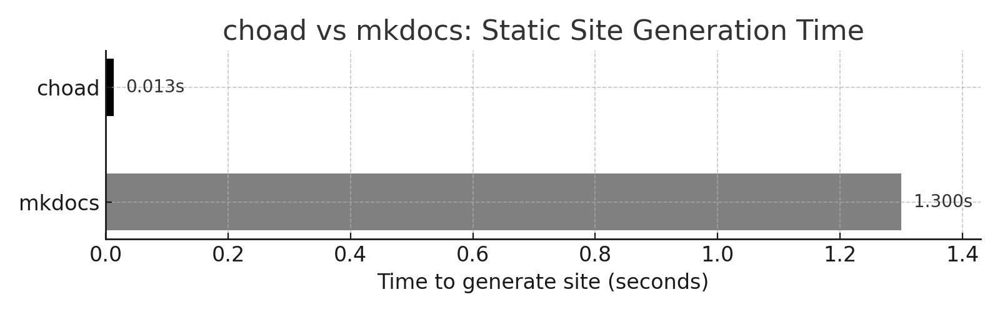

# choad

Comically Hyper-Optimizing All Docs. Written in Rust, for developers who know milliseconds aren't free.


**Brought to you by **Astra1**, building faster tools for problems you didn't know you had.**  

---

## Description

choad is a **Rust-powered** documentation generator for the Python ecosystem. Designed to deliver **unprecedented speed** and **efficiency** for Python projects where Sphinx and MkDocs is just too slow. Developed by **Astra1**, choad redefines what fast documentation builds can be — achieving **up to 100x faster performance**.

choad's advanced caching strategies, speculative pre-building, and multi-threaded Markdown parser work together to ensure your documentation compiles almost instantaneously — even when the original build time was barely noticeable.

## Using choad

choad is a near-perfect drop-in replacement for MkDocs. Replace calls to `mkdocs build` with simply `choad` and you'll be seeing 100x speed improvements.

```sh
Usage: choad [OPTIONS] [SOURCE]

Arguments:
  [SOURCE]  Source directory (defaults to 'docs') [default: docs]

Options:
  -d, --site-dir <OUTPUT>  Output directory (defaults to 'site') [default: site]
  -w, --watch              Enable watch mode
```

## Key Features

- 🏎️ **Uncompromising Speed** – By rethinking Markdown parsing from the ground up, choad optimizes every step of the build process to deliver faster results — even when those results were already pretty fast.  
- 🔎 **Speculative Pre-Building** – choad intelligently predicts which files are most likely to change and silently prepares them in the background, ensuring your documentation always feels ahead of you.  
- 🤑 **Aggressive Caching** – choad caches not just outputs, but intermediate steps, system states, and — in some cases — files you never actually modified.  
- 🎛️ **Minimal Configuration** – choad's zero-config default is designed to “just work,” but developers can unlock a wealth of options for advanced workflows.  
- 💪**Rust-Powered Reliability** – Marrying static typing with static sites, by built with Rust choad is engineered for consistent, repeatable results.

In our early tests of choad, we've found it to be on average 100x faster than conventional MkDocs.



## Why choad?
Most documentation tools are already fast enough — but Astra1 believes fast enough isn't **good enough**. choad was built on the principle that **every millisecond matters**, even if those milliseconds weren't bothering you before.

## Testimonials

> *"I didn't think my documentation was slow… but now it's "choad fast", and somehow that feels important."* — **Python Developer**  

> *"choad confidently told me it optimized my build times by 400%. I have no idea what that means, but I feel faster now."* — **Curiously Satisfied Engineer**  

> *"choad reduced my docs build time from 3 seconds to 0.3 seconds. I guess that's better?"* — **Mildly Impressed CTO**

## Acknowledgements

We's like to thank our choads for helping [sponsor the development](https://www.youtube.com/watch?v=tckxKea-MUw) of `choad`.

_**Made by Astra1** — *because time is precious, even when you aren't sure you're wasting it.*_
